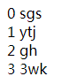
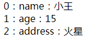

# 列表渲染

## v-for渲染

* 渲染一个数组 两个参数item代表内容 index 代表索引

```js
    data:{
        arr: [
            { msg: 'sgs' },
            { msg: 'ytj' },
            { msg: 'gh' },
            { msg: '3wk' }
        ]
    }
```
```html
    <div v-for="item,index in arr">
        {{ index }}
        {{ item.msg }}
    </div>
```


* 渲染对象 三个参数 value是值 key是键 index是索引

```js
    data:{
        obj: {
            name: '小王',
            age: 15,
            address: '火星'
        }
    }
```
```html
    <div v-for="value,key,index in obj">
        {{ index }}：{{ key }}：{{ value }}
    </div>
```


## 为了给 Vue 一个提示，以便它能跟踪每个节点的身份，从而重用和重新排序现有元素，你需要为每项提供一个唯一 key 属性

```html
    <div v-for="item in list" :key="item.id">{{item.value}}</div>
```

## 注意事项 数组
* Vue响应式渲染数组时候，不能检测某些更改数组的方法

* 利用数组的索引直接改变值 直接改变数组的length
```js
    data: {
        list: [
            { msg: 'dfg' },
            { msg: 'hgj' },
            { msg: 'sdf' },
            { msg: 'j' }
        ]
    }
    mounted(){
        // 页面不会自动渲染
        this.list[0] = { msg: 'new' }
        this.list.length = 0
    }
```

* 上述情况的解决方案
1. Vue.set/vm.$set   Vue.set(list, index, val)
2. splice  this.list.splice(...)

## 注意事项 对象

* 对于已经创建的实例，Vue 不允许动态添加根级别的响应式属性
```js
    data: {
        a: 1,
        obj: {
            name:'asd'
        }
    }

    vm.b = 2  // 用这种方法给vue新增的b属性 不会是响应式

    // 同样可以用Vue.set(obj, key, val)
    Vue.set(this.obj, 'age', 12)
```

* 想要添加多个键值对 利用Object.assign

```js
    this.obj = Object.assign({},this.obj,{
        ...
        ...
    })
```

## Demo  todo-list

```html
    <div id="app">
        <form @submit.prevent="handleadd">
            <input v-model="newlis" type="text">
        </form>
        <li v-for="item,index in todoList" :key="item.id">
            {{ item.title }}
            <button @click="todoList.splice(index,1)">x</button>
        </li>
    </div>
```

```js
    new Vue({
        el: '#app',
        data: {
            newlis: '',
            todoList: [{
                    id: 1,
                    title: 'asjk'
                },
                {
                    id: 2,
                    title: 'sgj'
                },
                {
                    id: 3,
                    title: 'fa'
                },
                {
                    id: 4,
                    title: 'ty'
                },
                {
                    id: 5,
                    title: 'rtu'
                }
            ],
            nextId: 6
        },
        created() {},
        methods: {
            handleadd() {
                this.todoList.push({
                    id: this.nextId++,
                    title: this.newlis
                })
                this.newlis = ''
            }
        }
    })
```