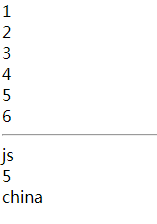
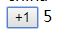
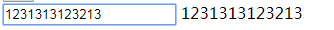
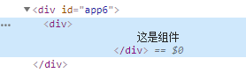
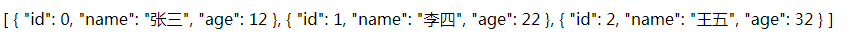
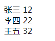

# 快速上手

## 简单传值
* 先随便建立一个html文件
* 直接在头部引入
```html
    <script src="https://cdn.jsdelivr.net/npm/vue/dist/vue.js"></script>
```

* 建立根目录
```html
    需要根据id选择元素
    <div id="app"></div>
```

* 实例化一个Vue
```js
    // el固定写法 绑定的元素
    new Vue({
        el: '#app'
    })
    // 现在这个实例与 <div id="app"></div> 绑定了
```

* 传值&接收
```js
    // 数据存放在实例的 data 下
    new Vue({
        el: '#app',
        data: {
            msg: 'hello'
        }
    })
```
```html
    此时可以传值了 直接用 {{  }} 语法糖 里面可以直接写data内的变量
    <div id="app">{{ msg }}</div>
    成功渲染
```    


## 元素的显示隐藏
* 在data里定义一个布尔值 表示显示隐藏
```js
    data: {
        show: true
    }
```
* 在html元素里添加一个元素 使用v-if指令绑定show
```html
    使用v-if指令绑定show
    <div id="app2">
        <div v-if="show">显示隐藏</div>
    </div>
    这时候改变show的值就会显示隐藏div了
```

## 列表的渲染
```js
    data: {
        // data里放一个数组 或者对象 
        list: [1,2,3,4,5,6],
        list2: { name: 'js', age: 5, address: 'china' }
    }
```
* 在html里使用v-for绑定列表数据
```html
    item in list    list是列表   item是内容   之后直接渲染item
    <div id="app3">
        <div v-for="item in list">{{ item }}</div>
        <hr>
        渲染对象会渲染值
        <div v-for="item in list2">{{ item }}</div>
    </div>
```


# 绑定事件
* 做一个+1功能的按钮
```js
    // data里面定义一个count 表示数字
    data: {
        count: 0
    }
    // 新写一个 methods: {} 存放方法
    methods: {
        // 定义一个add方法 通过this获取到count  再++
        add(){
            this.count++
        }
    }
```

* html
```html
    下面的 {{ count }} 渲染数字 默认写的0
    按钮 通过 v-on:click指令添加方法add
    此时点击按钮就能让count++ 渲染在页面上
    <div id="app4">
        <button v-on:click="add">+1</button>
        {{count}}
    </div>
```



# v-model 双向绑定

```js
    // data 写一个要绑定的数据默认是空
    data: {
        msg: ''
    }
```
```html
    <div id="app5">
        渲染msg  此时是空
        {{ msg }}
    </div>
```
```html
    使用v-model指令 绑定msg
    <div id="app5">
        <input v-model="msg" type="text">
        {{ msg }}
    </div>
    这样就完成了双向绑定
```


## 组件以及简单传值

* 定义一个组件 然后实例传值给它 让组件渲染数据
```js
    // 定义一个组件
    // todolist是组件名 直接当标签写在html里
    Vue.component('todolist', {
        template: `
            <div>
                这是组件
            </div>    
        `
        // template   是语法糖  直接在里面写html代码表示组件内容
    })

    // 定义一个数组数据
    data: {
        list: [
            {id: 0, name: '张三', age:12},
            {id: 1, name: '李四', age:22},
            {id: 2, name: '王五', age:32}
        ]
    }
```
* 定义好了组件 在页面渲染出来

```html
    <div id="app6">
        直接使用组件名就能渲染 此时页面已经有  这是组件 的字符串
        <todolist></todolist>
    </div>
```


* 传值 通过v-bind绑定一个变量="list"
```html
    <div id="app6">
        state是一个变量
        <todolist v-bind:state="list"></todolist>
    </div>
```

* 组件内通过props接受变量
```js
    Vue.component('todolist', {
        // 写法 props: ['']  里面写变量名 如果有多个变量 就是 ['变量1', '变量2'] 
        props: ['state'],
        // 得到state可以先渲染看看
        template: `
            <div>
                {{ state }}
            </div>    
        `
    })
```


* 既然得到数据 当然也能在组件用v-for渲染

```js
    Vue.component('todolist', {
        props: ['state'],
        template: `
            <div>
                <div v-for="item in state">{{ item.name }} {{ item.age }}</div>
            </div>    
        `
    })
```
* 成功渲染


* 除了在组件里面v-for渲染  也能在组件名标签上渲染传值

```html
    <div id="app6">
        直接在这里循环 然后传入的值是item 而不是list 注意这样做的话还需要绑定一各key值
        <todolist v-for="item in list" v-bind:key="item.id" v-bind:state="item"></todolist>
    </div>
```
```js
    // 组件内不需要循环了 直接用state
    template: `
        <div>
            {{ state.name }} {{ state.age }}
        </div>    
    `
    // 同样渲染出来
```

